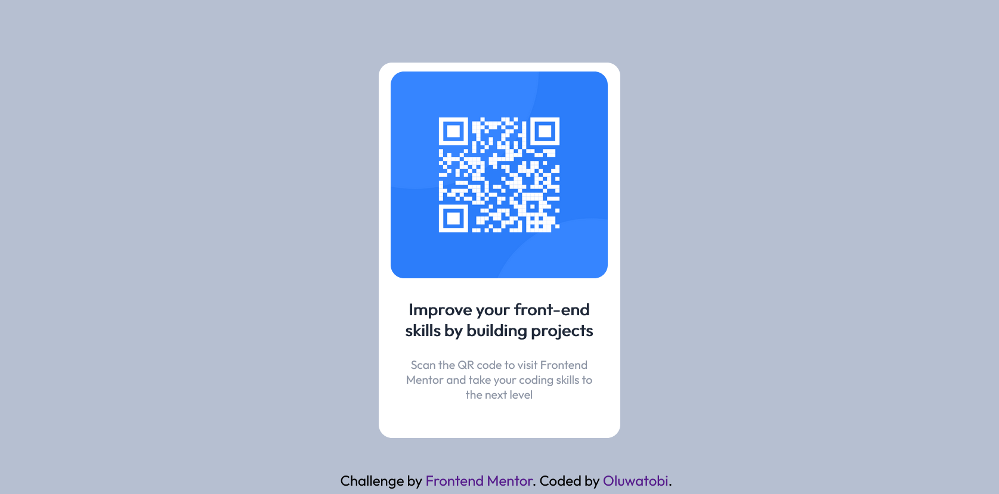

# Frontend Mentor - QR code component solution

This is my solution to the [QR code component challenge on Frontend Mentor](https://www.frontendmentor.io/challenges/qr-code-component-iux_sIO_H). Frontend Mentor challenges help you improve your coding skills by building realistic projects. 

## Table of contents

- [Overview](#overview)
  - [Screenshot](#screenshot)
  - [Links](#links)
- [My process](#my-process)
  - [Built with](#built-with)
  - [What I learned](#what-i-learned)
  - [Continued development](#continued-development)
  - [Useful resources](#useful-resources)
- [Author](#author)
- [Acknowledgments](#acknowledgments)


## Overview

This challenge is mainly deasigned to sharpen your CSS knowledge as there are just few `html` tags you will use to complete the challenge.
The major focus is how to position elements and make sure they are also responsive.

### Screenshot



### Links

- [full code](https://github.com/sammiie/QRCodePage_fm/index.html).
- [live page](https://sammiie.github.io/QRCodePage_fm/)

## My Process

### Built with

The challenge was completed using `html` and `css`   
I used Sublime Text as text editor as code editor while testing with a browser to see how its rendered.

### What I learned

- how to center a div elements horizontally and vertically
  ```css
      div{
       positon: absolute;
       left: 50%;
       top: 50%;
       transform: translate(-50%, -50%);
        }
  ```
- I get to understand the different CSS positioning
  - `position:fixed;`
  - `position: absolute;`
  - `position: relative;`
- How to import google fonts and use them in my code

### Continued Development

- CSS box-sizing property
- CSS flex property
- CSS grid property

### Useful resources

- [ Stack Overflow](https://stackoverflow.com/) - This helped me when I was troubleshooting git issues during push
- [Markdown Guide](https://www.markdownguide.org/basic-syntax/) - I used this while writing this README 
- [W3schools](https://www.w3schools.com/css/css_positioning.asp) - I consulted this platform as reference for CSS syntax and guide
